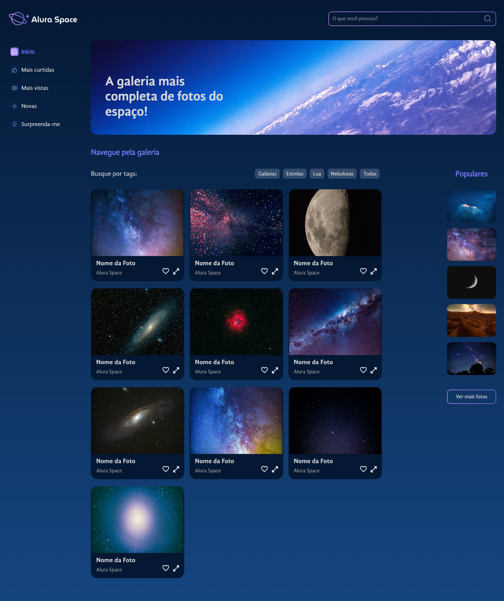

<h1 style="text-align: center;">Alura Space</h1>
<h2 style="text-align: center; margin-bottom: 2rem">A galeria mais completa de fotos do espaço!</h2>

Site desenvolvido durante o curso "React com JavaScript: lidando com arquivos estáticos" da Alura.

<h3 style="margin-top: 2rem">
    :books: Tópicos estudados: :books:
</h3>
<ul style="margin-bottom: 2rem">
    <li>React
    <li>Componentes do React
    <li>Organização de arquivos
    <li>Lidar com arquivos estáticos
    <li>CSS modules
    <li>Funções JS de array para renderização dinâmica de componentes
</ul>
<a href="https://alura-space-roan.vercel.app/" target="_blank">Verifique a aplicação aqui</a>
 

